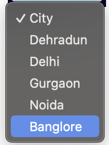
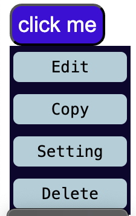

# Dropdown menu

## Description :

In this file there are two type of drop down menu are present , one excuting through js and other only by html.

##### Have a look here

## Intstallation

1.  Install all the dev dependencies which are present in json by `npm i` or `npm install` in command line.

## Bundler Use

1. file `Webpack.config.js` add.
2. css loader, style loader, html plugin, file loader.
